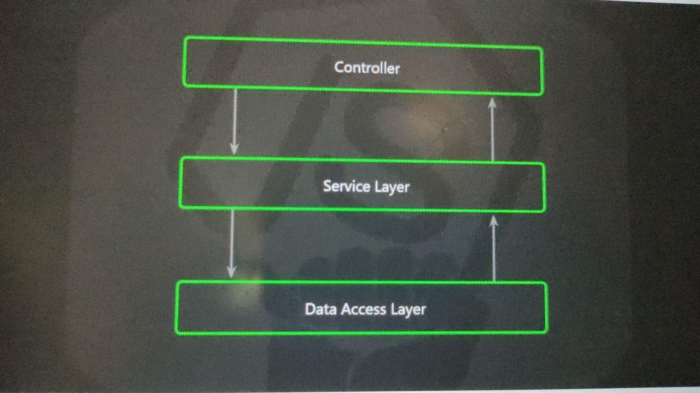
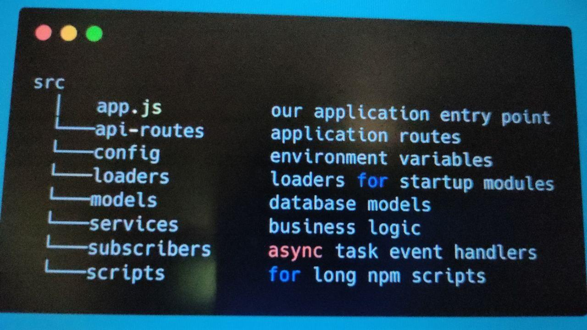
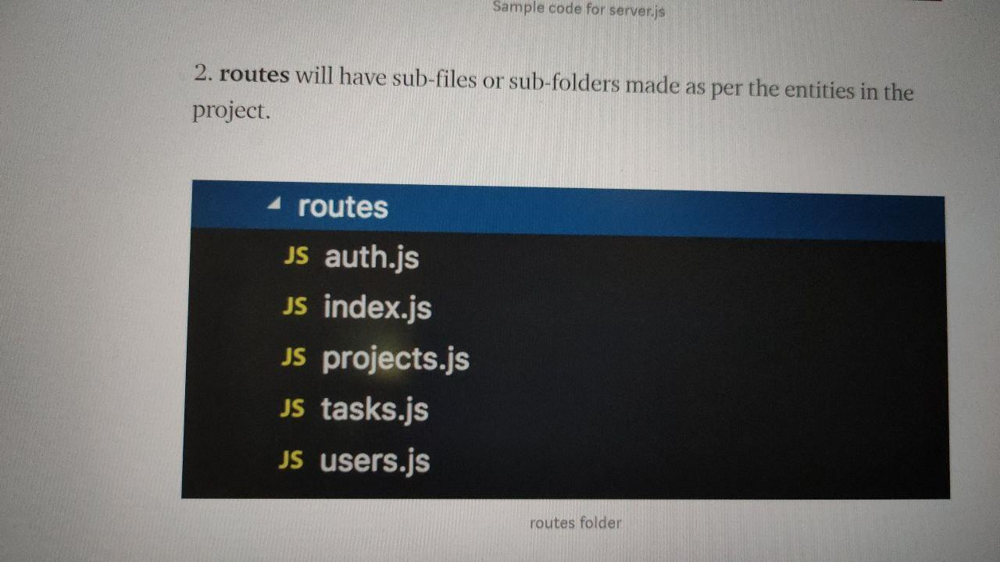

# Setup
## installing app dependencies

`if using npm`
> npm install
 

`if using yarn`
 
> yarn install

  

# Project Structure and Architecture

<h3>Express: Layered Data Calls</h3>

<h3>Folder Structure Notes</h3>

<h3>Express Server: Example of Api Routes</h3>

# Running the App

`if using npm`
> npm run start:dev \

`if using yarn` 
> yarn run start:dev

# Logistics

## 1- Login System `(We will use passport-local)`

## Make a Log-in system.
> Add Bar-code to each account.
 
> Make two portal, one for some-one who will insert data, other user user who will scan the code.

## User will sign-in.
He will get the bar-code, this bar-code is connected with database.
He will insert data.
If someone scan this bar-code, the inserted data will be shown to him.

## Sign UP

Take name, email and password from user 
Validate if user have filled all feild  
Validate if password is matched with confirm password 
Check if user is exits in database or not 
Hash the password 
Save it in Database 

## Login

Take email and password from user 
Check if user is that email is present in database or not 
Dehash password and compare 
If password matched send user to sucess page, if not send user to login page 
Set cookies

## Logout

Logout of session.
When back button is pressed after logout authenticate it.

## Need ui wirframe to start with design

